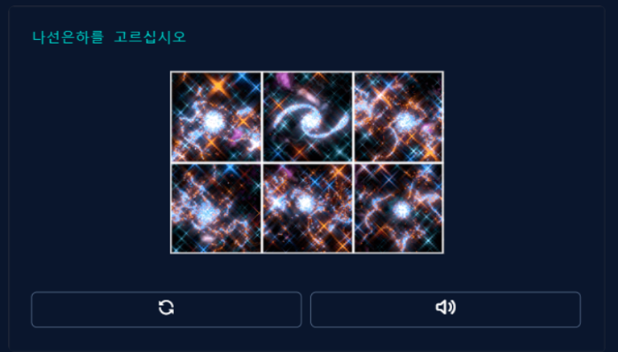

# manuals
깃허브 사용법을 연습합니다

여기에 원하는 내용을 입력하세요

*작성한* __소스__ 에 ***대한*** 간단한 소개글을 작성합니다

>원하는 내용을 입력하세요

>>저장소에 대한 ~~소개글을~~ 작성합니다

#제목을 표시
 
가로줄

---

***

1. 1번
3. 3번
2. 2번
4. 4번

- 원격저장소 만들기
  - 오리진 연결하기
  - 푸시
- 풀 , vs 패치
  - 협업하기
- 별기호 섞어쓰기

''' 
function add(x,y) {return x*y;}

'''

<http://www.naver.com>

[네이버](http://www.naver.com)

